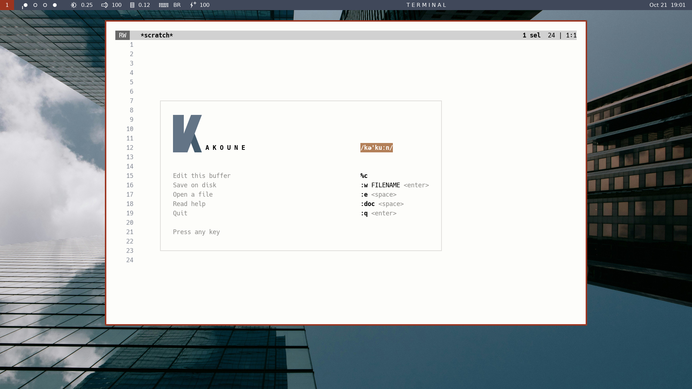

# splash.kak

A splash screen for the Kakoune editor.

# Installation

Copy `splash.kak` somewhere in your autoload directory tree.

# Configuration

Options are available to customize:

- the frame color, `splash_frame` (default `rgb:dfdedb`)

- the body of the K letter, `splash_k_body` (default `rgb:637486`)

- the leg of the K letter, `splash_k_leg` (default `rgb:435a6c`)

- the foreground for /kə'kuːn/, `splash_phon_fg` (default `rgb:ffffff`)
- the background for /kə'kuːn/, `splash_phon_bg` (default `rgb:b38059`)

- the color of faded help messages, `splash_faded` (default `rgb:8a8986`)

Set these options globally in your `kakrc` file. Each color you specify
must be a named color (e.g., `red`) or be in the rgb:RRGGBB format.

## Note

This plugin is just a hook that fires whenever Kakoune opens a buffer named
\*scratch\*. Visible content is a register pasted into the scratch buffer.

## License

MIT

